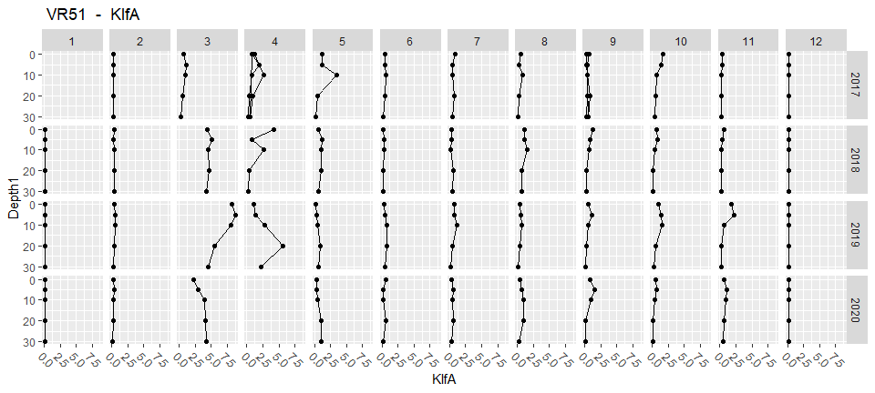
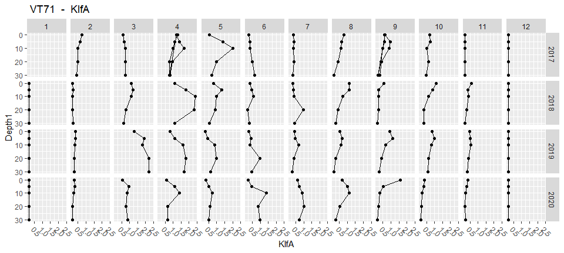
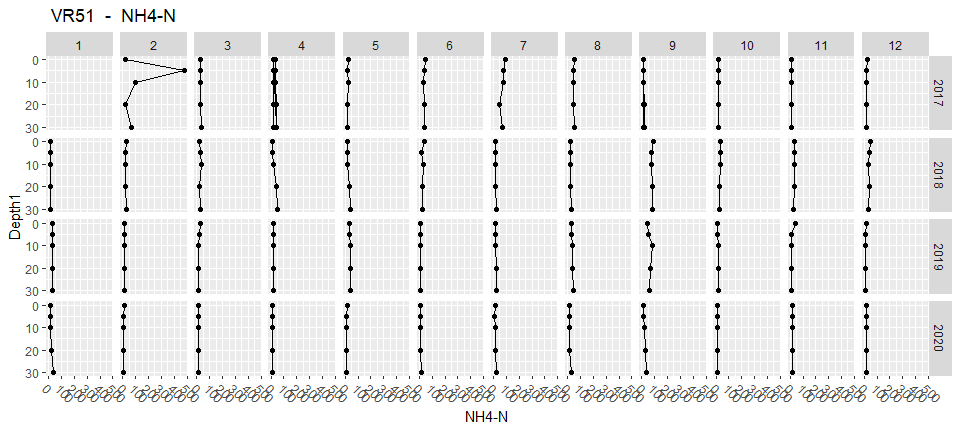
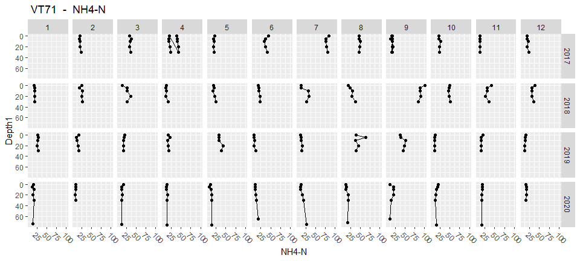
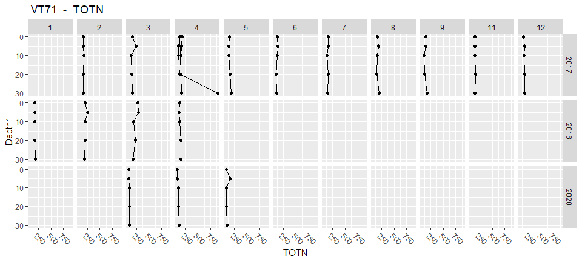
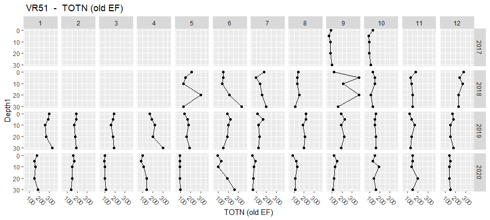
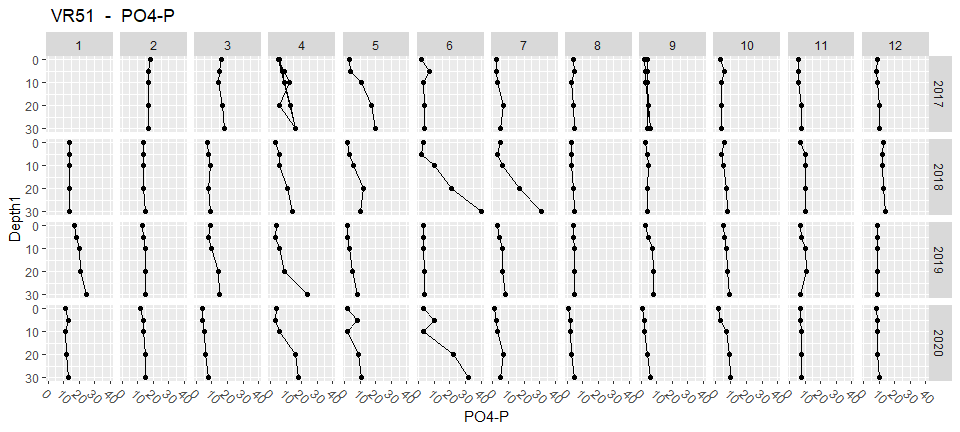
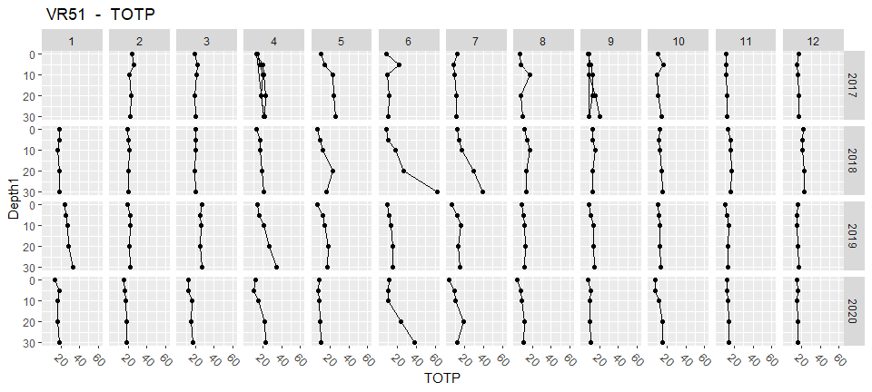
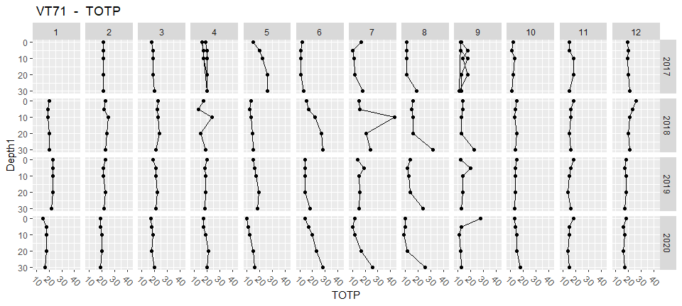

**QC of Norskehavet Sør I (Caroline + Lars)**      
- Checked input to these files:  
`K:\Prosjekter\Sjøvann\KYSTOVERVÅKING ØKOKYST\KYSTOVERVÅKING ØKOKYST 2017-2020\ØKOKYST DP Norskehavet Sør I O-17091_18091_19091_200091\Rapport 2019-data\klassification`
- Stations:
    + VT71 Skinnbrokleia
    + VR51 Korsen
  
- **Note: Here we download data from Aquamonitor insted of reading excel files (as last year)**  

**Veileder:**  
- `Documents\artikler\veiledere etc\02_2013_klassifiserings-veileder_.pdf`  
- Chlorophyll: page 91.   
"I SørNorge (til Stadt) anbefales det at innsamlingen starter i februar og avsluttes ved utgangen av oktober."   
"Nord for Stadt anbefales det at innsamlingsperioden strekker seg fra mars til og med september."   
90% percentiles should be used   
  
- Also see calculation example on on page 187-189, and the comment on page 189:  
"Det gjøres oppmerksom på at dataprogrammene som beregner 90-persentil, gjerne benytter ulike metoder". We use the Excel method PERCENTILE.EXC, corresponding to type 6 quantiles in R  
  
- Nutrients: page 102 in veileder  
Vinter er november til og med februar   
Sommer er juni til og med august  

  
## 0. Libraries   
If you ony want to look at Norskehavet Sør 1  you can skip to 11 after this chunk      

```r
library(dplyr)
```

```
## Warning: package 'dplyr' was built under R version 4.0.3
```

```
## 
## Attaching package: 'dplyr'
```

```
## The following objects are masked from 'package:stats':
## 
##     filter, lag
```

```
## The following objects are masked from 'package:base':
## 
##     intersect, setdiff, setequal, union
```

```r
library(purrr)
library(ggplot2)
library(lubridate)
```

```
## Warning: package 'lubridate' was built under R version 4.0.3
```

```
## 
## Attaching package: 'lubridate'
```

```
## The following objects are masked from 'package:base':
## 
##     date, intersect, setdiff, union
```

```r
library(readxl)
library(tidyr)
```

```
## Warning: package 'tidyr' was built under R version 4.0.3
```

```r
library(knitr)         
```

```
## Warning: package 'knitr' was built under R version 4.0.3
```

```r
library(RColorBrewer)

# library(niRvana)

source('11_Read_from_Nivabasen_functions.R')  # Used to read from Nivadatabase

source("12_QA_2019_from_excel_functions.R")
source("13_QA_CTD_2019_functions.R")          # used in section 15  


library(niRvana)

# RColorBrewer::display.brewer.all()
```

### Set Nivadabase password 


```r
# Do this once:
# set_credentials()
```


## 1. Read Norskehavet Nord I nutrients     


```r
### Test  
# - Run only to find which parameter names/ids to use (from WC_PARAMETER_DEFINITIONS)   

# We start with station VR51, and dig all the way from 
# table PROJECTS_STATIONS to WC_PARAMETER_DEFINITIONS

if (FALSE){
  
  # For copy/pasting column names  
  nm <- function(df)
    names(df)  %>% paste(collapse = ", ")
  
  df_projstat <- get_nivabase_selection(
    "PROJECT_ID, STATION_ID, STATION_CODE, STATION_NAME, STATION_IS_ACTIVE", 
    "PROJECTS_STATIONS", 
    "STATION_CODE", 
    "VR51", values_are_text = TRUE)
  df_projstat
  
  df_watersamp <- get_nivabase_selection(
    "WATER_SAMPLE_ID, STATION_ID, SAMPLE_DATE, DEPTH1, DEPTH2, REMARK, SAMPLE_POINT_ID",
    "WATER_SAMPLES", 
    "STATION_ID, ", 
    df_projstat$STATION_ID)
  
  df_waterchem <- get_nivabase_selection(
    "WATER_SAMPLE_ID, METHOD_ID, VALUE, UNCERTAINTY, FLAG1, FLAG2, REMARK, APPROVED", 
    "WATER_CHEMISTRY_VALUES", 
    "WATER_SAMPLE_ID", 
    subset(df_watersamp, year(SAMPLE_DATE) == 2020 & month(SAMPLE_DATE) == 8)$WATER_SAMPLE_ID)
  
  # df_waterchem %>% nm() 
  
  xtabs(~METHOD_ID, df3a)
  
  df_m <- get_nivabase_selection(
    "METHOD_ID, NAME, UNIT, LABORATORY, DESCR, MATRIX, CAS, IUPAC", 
    "METHOD_DEFINITIONS", 
    "METHOD_ID", 
    unique(df_waterchem$METHOD_ID))
  
  df_mpar  <- get_nivabase_selection(
    "PARAMETER_ID, METHOD_ID, CONVERSION_FACTOR", 
    "WC_PARAMETERS_METHODS", 
    "METHOD_ID", 
    df_m$METHOD_ID)
  # nm(df_mpar)
  
  df_par <- get_nivabase_selection(
    "*", 
    "WC_PARAMETER_DEFINITIONS", 
    "PARAMETER_ID", 
    unique(df_mpar$PARAMETER_ID))
  par_names1 <- df_par$NAME
  
  # Get the other TOTN parameters too
  df_par_all <- get_nivabase_data(
    "select * from NIVADATABASE.WC_PARAMETER_DEFINITIONS")  # 716 rows
  nm(df_par_all)
  
  par_names2 <- df_par_all %>%
    filter(grepl("TOTN", NAME) & !DESCR %in% "FAGDATA2") %>%
    pull(NAME)
  
  par_names <- unique(c(par_names1, par_names2))
  par_names
  
} 
# dput(par_names)
```

### Get data  

```r
# Read from NIvabase (1 minute) or read from saved data?
read_from_nivabase <- FALSE


par_names <- c("NO3+NO2-N", "NH4-N", "TOTP", "PO4-P", "SiO2", 
               "KlfA", "TSM", 
               "TOTN (old EF)", "TOTN", "TOTN (est.)")

stations <-  c("VR51", "VT71")


if (read_from_nivabase){
  # debugonce(get_water_chemistry)
  df_chem <- get_water_chemistry(stationcodes = stations,
                                 parameters = par_names, 
                                 years = 2017:2020) %>%
    mutate(Year = year(SAMPLE_DATE),
           Month = month(SAMPLE_DATE))
  
  # Uncomment to save again:
  # saveRDS(df_chem, "Data/17_2020_df_chem.rds")  
  
} else {

  df_chem <- readRDS("Data/17_2020_df_chem.rds")  
  
}

cat(nrow(df_chem), "rows of data downloaded \n")
```

```
## 3983 rows of data downloaded
```

```r
cat("Stations:", paste(stations, collapse = ", "), "\n")
```

```
## Stations: VR51, VT71
```

```r
cat("Parameters:", paste(par_names, collapse = ", "), "\n")
```

```
## Parameters: NO3+NO2-N, NH4-N, TOTP, PO4-P, SiO2, KlfA, TSM, TOTN (old EF), TOTN, TOTN (est.)
```


### Measurements by parameter, site and year    

```r
xtabs(~Year + PARAM_NAME + STATION_CODE, df_chem)
```

```
## , , STATION_CODE = VR51
## 
##       PARAM_NAME
## Year   KlfA NH4-N NO3+NO2-N PO4-P SiO2 TOTN TOTN (old EF) TOTP TSM
##   2017   65    65        65    65   65   55            10   65  65
##   2018   60    60        60    60   60   20            40   60  59
##   2019   60    60        60    60   60    0            60   60  60
##   2020   55    60        60    60   60   15            60   60  60
## 
## , , STATION_CODE = VT71
## 
##       PARAM_NAME
## Year   KlfA NH4-N NO3+NO2-N PO4-P SiO2 TOTN TOTN (old EF) TOTP TSM
##   2017   65    65        65    65   65   55            10   65  65
##   2018   60    60        60    60   60   20            40   60  59
##   2019   60    60        60    60   60    0            60   60  60
##   2020   60    70        70    70   70   15            60   60  60
```
### Measurements by depth, site and year    

```r
df_chem %>%
  distinct(STATION_CODE, Year, DEPTH1, SAMPLE_DATE) %>%
  xtabs(~ DEPTH1 + Year + STATION_CODE, .)
```

```
## , , STATION_CODE = VR51
## 
##       Year
## DEPTH1 2017 2018 2019 2020
##     0    13   12   12   13
##     5    13   12   12   13
##     10   13   12   12   13
##     20   13   12   12   13
##     30   13   12   12   13
##     65    0    0    0    0
##     71    0    0    0    0
##     74    0    0    0    0
##     75    0    0    0    0
##     76    0    0    0    0
## 
## , , STATION_CODE = VT71
## 
##       Year
## DEPTH1 2017 2018 2019 2020
##     0    13   12   12   12
##     5    13   12   12   12
##     10   13   12   12   12
##     20   13   12   12   12
##     30   13   12   12   12
##     65    0    0    0    2
##     71    0    0    0    1
##     74    0    0    0    1
##     75    0    0    0    2
##     76    0    0    0    4
```
### Parameters  

```r
check <- df_chem %>%
  group_by(STATION_CODE, SAMPLE_DATE, DEPTH1, PARAM_NAME) %>%
  summarise(n = n()) %>%
  filter(n > 1)
```

```
## `summarise()` regrouping output by 'STATION_CODE', 'SAMPLE_DATE', 'DEPTH1' (override with `.groups` argument)
```

```r
if (nrow(check) > 0)
  stop("Some combinations of STATION_CODE, SAMPLE_DATE, DEPTH1, PARAM_NAME occurs >1 time!")

df_chem %>%
  count(PARAM_NAME, NAME)
```

```
## # A tibble: 10 x 3
##    PARAM_NAME    NAME                 n
##    <chr>         <chr>            <int>
##  1 KlfA          Klorofyll A        485
##  2 NH4-N         Ammonium           500
##  3 NO3+NO2-N     Nitritt + nitrat   500
##  4 PO4-P         Fosfat             500
##  5 SiO2          Silikat            500
##  6 TOTN          Total nitrogen     180
##  7 TOTN (old EF) Total nitrogen     340
##  8 TOTP          Total fosfor       490
##  9 TSM           TSM                351
## 10 TSM           TSM-F              137
```

### Reformat data

```r
dat <- df_chem %>%
  select(STATION_CODE, SAMPLE_DATE, DEPTH1, PARAM_NAME, VALUE) %>%
  tidyr::pivot_wider(names_from = "PARAM_NAME", values_from = "VALUE") %>%
  rename(StationCode = STATION_CODE, 
         Date = SAMPLE_DATE, 
         Depth1 = DEPTH1)

dat
```

```
## # A tibble: 505 x 12
##    StationCode Date                Depth1 `NH4-N`   TSM  SiO2 `NO3+NO2-N`  TOTP
##    <chr>       <dttm>               <dbl>   <dbl> <dbl> <dbl>       <dbl> <dbl>
##  1 VT71        2017-02-16 00:00:00      0      20  0.19   330          75    21
##  2 VT71        2017-02-16 00:00:00      5      19  0.51   320          75    21
##  3 VT71        2017-02-16 00:00:00     10      20  0.37   340          79    21
##  4 VT71        2017-02-16 00:00:00     20      20  0.21   350          81    21
##  5 VT71        2017-02-16 00:00:00     30      23  0.21   330          79    21
##  6 VT71        2017-03-20 00:00:00      0      32  0.53   130          43    18
##  7 VT71        2017-03-20 00:00:00      5      38  0.48   140          41    19
##  8 VT71        2017-03-20 00:00:00     10      34  0.46   110          42    19
##  9 VT71        2017-03-20 00:00:00     20      33  0.55   110          45    19
## 10 VT71        2017-03-20 00:00:00     30      36  0.47   120          45    20
## # ... with 495 more rows, and 4 more variables: TOTN <dbl>, `PO4-P` <dbl>,
## #   KlfA <dbl>, `TOTN (old EF)` <dbl>
```
  
## Chl a   
<!-- --><!-- -->

## Nutrients  


```r
# 
# Alternative way - but doesn't give headings  
#
if (FALSE){
  
  df <- df_chem %>%
    distinct(STATION_CODE, PARAM_NAME) 
  
  walk2(
    df$STATION_CODE[1:3],
    df$PARAM_NAME[1:3],
    ~plot_ctdprofile_station(stationcode = .x, 
                             variable = .y,
                             data = dat, 
                             points = TRUE)
  )
  
}
```

### NH4-N
<!-- --><!-- -->


### NO3+NO2-N
<!-- --><!-- -->


### TOTN
<!-- --><!-- -->


### TOTN (old EF) 
<!-- --><!-- -->


### PO4-P
<!-- --><!-- -->

### TOTP
<!-- --><!-- -->

### SiO2
<!-- --><!-- -->

### TSM
<!-- --><!-- -->


